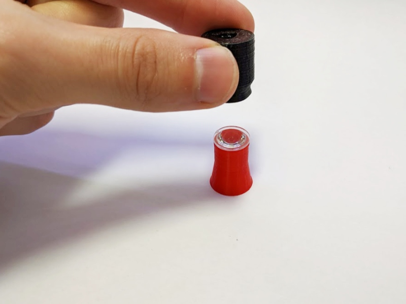
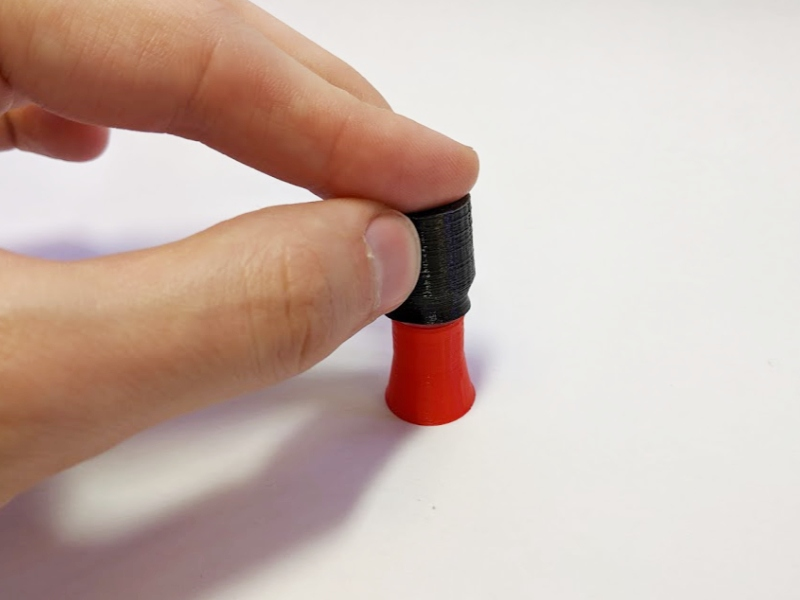
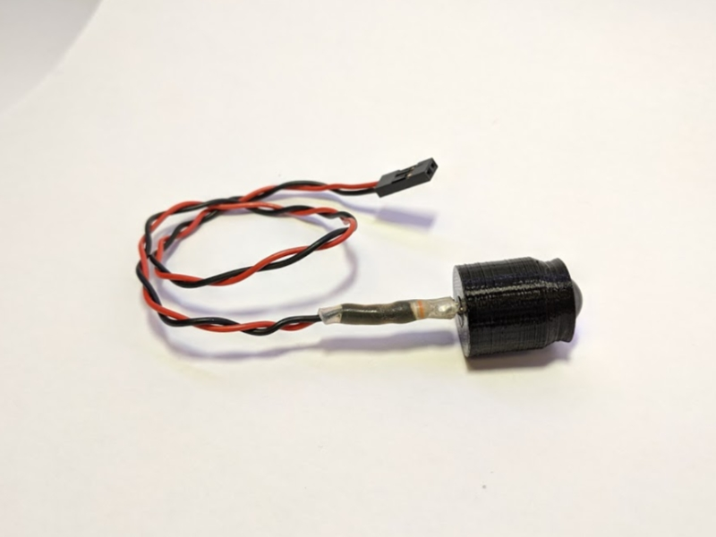
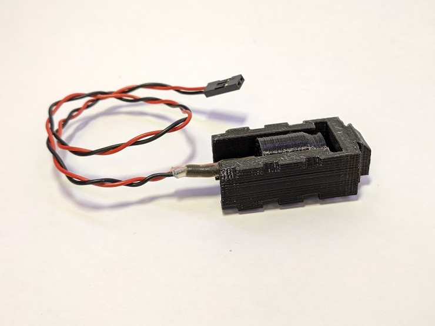
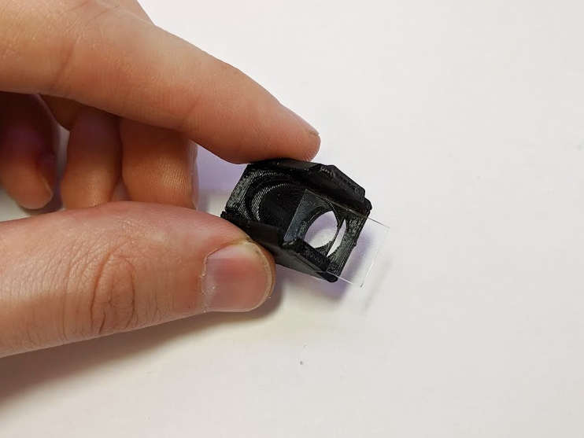
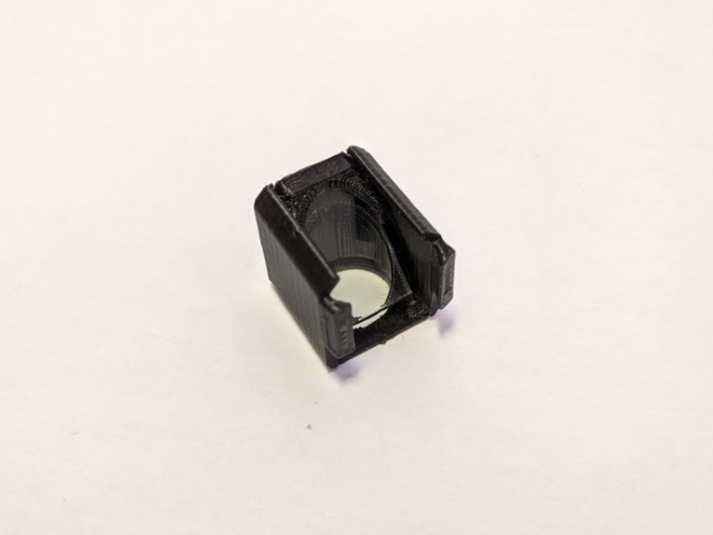
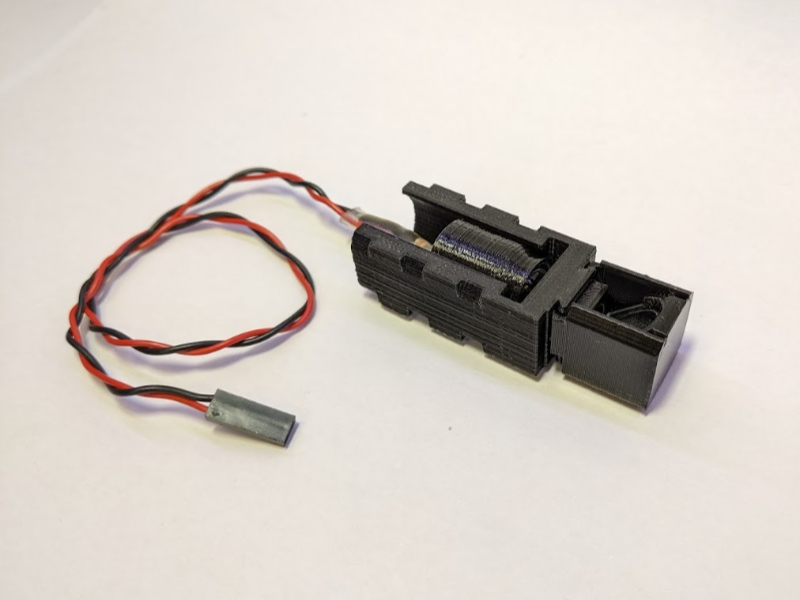
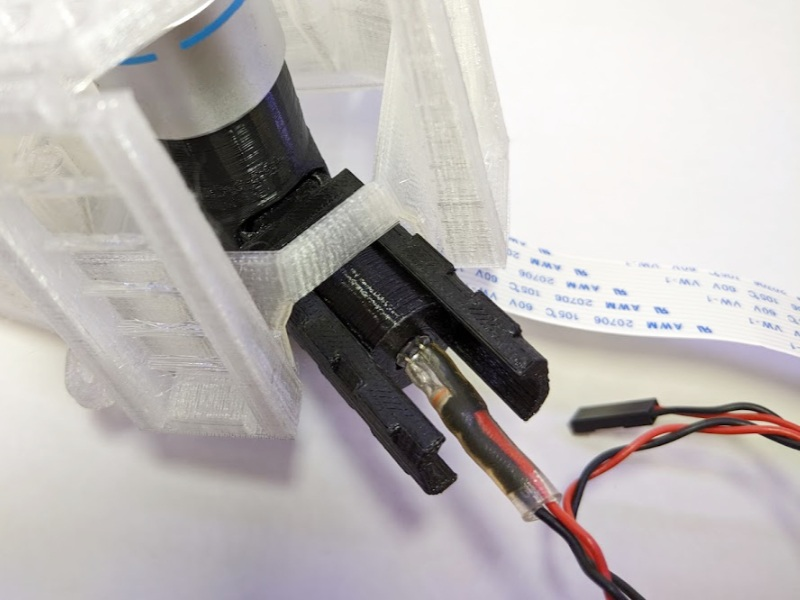

# Assemble the reflection illumination

The microscope can illuminate the sample from below, allowing imaging of reflected, instead of transmitted, light.  This section takes you through the assembly of the reflection illumination arm.

# Requirements

## Parts

* 1 [5mm LED](./parts/electronics/white_led.md) ideally wired up to a 2-way female header
* 1 [condenser lens](./parts/optics/condenser_lens.md)
* 1 [filter cube](./parts/printed/fl_cube.md)
  * Requires 1.5mm thick optical filters (eg. 50/50 splitter, or dichroic filters) to insert
* 1 [reflection illuminator](./parts/printed/reflection_illuminator.md)

## Tools

* [Condenser lens insertion tool](./parts/printed_tools/lens_tool.md)

# Assembly Instructions

## Step 1

Place the condenser lens on the insertion tool (flat side up), and push the condenser housing down onto it.  Take care to keep it vertical.  You may need to push fairly hard.  As with the tube lens in the optics module, check it's flat and push again if necessary.

## Step 2

Insert the LED into the condenser housing.  It should push-fit and stay in place.  It can be glued or taped if it doesn't stay in.

## Step 3

Assemble the cable for the LED, if you don't have one soldered on already.  You just need to be able to light it up - we usually do this by soldering the LED to a resistor (about 80 ohms), then attaching about 20cm of cable with female crimps on the end.  This can easily be plugged onto the Raspberry Pi's 5v GPIO pin.

## Step 4

Insert the condenser housing into the illumination holder. Tighten with a cable tie if the condenser housing is loose within the holder.

## Step 5

Insert your chosen filters into the filter cube. Most applications will require a filter in the 45 degree slot. If the filter fits tightly, gently use tweezers(or similar) to push the filter into place.

Additional excitation and emission filter slots are available if needed, for example for fluorescence microscopy.

## Step 6

Slide the filter cube onto the illumination holder dovetail. The two should ideally be vertically centered with eachother.

## Step 7

Push the reflection-illuminator/filter-cube assembly into the filter cube slot on your optics module.

