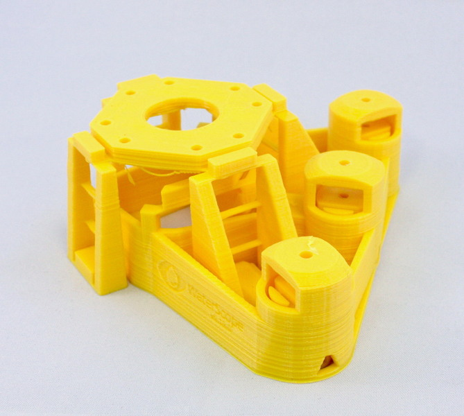
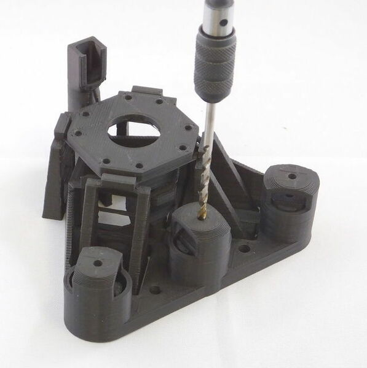
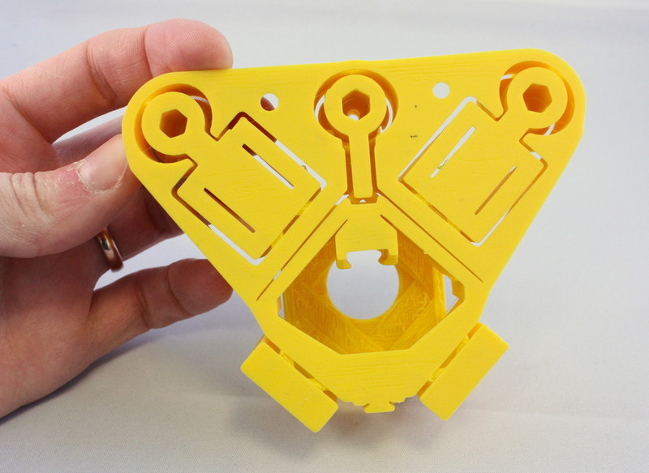

# Microscope Body
This part is the main body of the microscope, including all the flexure mechanisms.  It's by far the biggest print, and is where most of the exciting bits live.

## Printing Instructions
This should be printed without support material.  On smaller/less well calibrated machines, I print this part on its own and then print the rest of the parts in a second print.  Which version of the body you need depends on two things: firstly, the height of the stage, and secondly whether you want attachment lugs for motors.  The microscope body takes around 10 hours on a RepRapPro Ormerod (and many other low-end printers) or about 8 hours on Ultimaker, MakerBot, or Prusa i3 Mk3 and the like. 

### STL File
The main body is printed from ``main_body_LS<height>.stl``, or ``main_body_LS<height>-M.stl`` where ``<height>`` is either 65 or 75 depending on how tall you want the microscope to be.  We almost exclusively use a height of 65mm, and if a taller stage is required (e.g. to use a larger microscope objective) we combine it with a [sample riser](./sample_riser.md).  The ``-M`` in the filename means it includes motor lugs - these allow you to attach stepper motors to the microscope and move it automatically.  If in doubt, print ``main_body_LS65-M.stl`` because you can always just ignore the lugs, and add a riser, if it turns out you have the wrong one!

### Actuator cleanup
After printing, you may run a 3mm drill bit through the 3mm holes in each actuator, to ensure the screws can rotate freely (usually this is not necessary).

### Brim cleanup
If the bottom layer has oozed out too much, or if you used a brim you might need to clean up the bottom so it looks like this - it's important that the moving parts aren't stuck to the body with a thin layer of plastic.

### Cleaning up the bridges
You may need to use needle-nose pliers to pull strings of plastic from the underside of the microscope stage.  If your printer is correctly calibrated there shouldn't be much, and I often get away without any - but some printers (particularly if using ABS) are prone to a bit of "spaghetti" under the stage.

