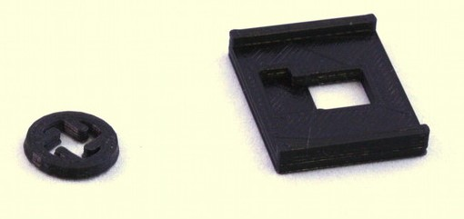

# Raspberry Pi Camera lens removal tools
These tools make it easier and safer to remove the lens from a Raspberry Pi camera module.  See the documentation for the optics module for instructions.  These tools are for version 2 of the camera board, if you have a v1 camera module you may need to use mini pliers to remove the lens.  Version 2 of the Raspberry Pi camera module now comes with a lens removal tool, which is better than the printed one - but the board gripper is still useful.

## STL Files
There are two printable tools that are useful:
* ``picamera_2_gripper.stl`` is a rectangular jig that fits over the board, and stops the camera module from twisting when you unscrew the lens.
* ``picamera_2_lens_gripper.stl`` is a "spanner" to unscrew the lens.  Use this only if you don't have the original white plastic tool that is supplied with the camera module.

